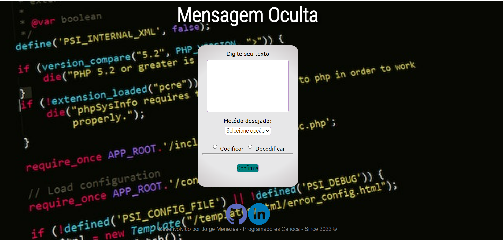

<strong><h1>Mensagem Oculta - Codificador</h1></strong>

Trabalho proposto era desenvolver um Codificador e Decodificador de códigos de Base64 & Cifra de César.

<h2><strong>Linguagens Utilizadas:</strong></h2>

 - HTML5
 - CSS
- JAVASCRIPT
 
 
 
<H2><li>HTML5:</li></h2>
Usado para a montagem da base da projeto. Nele foi colocado a caixa para ser inserido o texto a ser codificado,a caixa onde  seria entregue o texto codificado,o botão para execução do processo,a aba para a seleção de qual codificador seria(Base64 ou Cifra de César) entre outras opções.
 
 
 
<h2><li>CSS:</li></h2>
Usado para Estilizar a pagina. Onde foi colocado outro tipo de fonte,coloração do botão de codiificar,imagem de fundo entre outros.
 
 
 
<h2><li>JAVASCRIPT:</li></h2>
Usado para dar a funcionalidade para a página,para que pudesse exercer o que foi pedido. a codificação dos textos em Base64 e Cifra de César e Decodificação dos mesmos.
 
 
 
 

 
 

<h1>Produto Final</h1>

